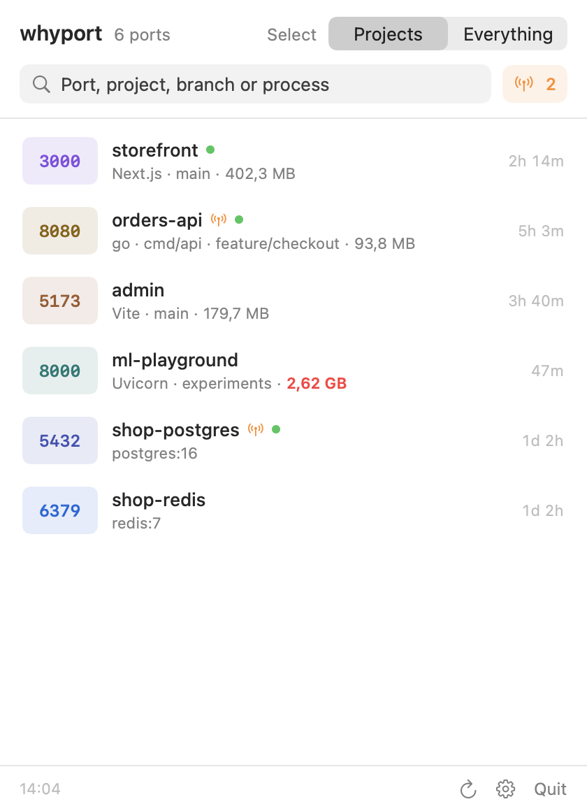
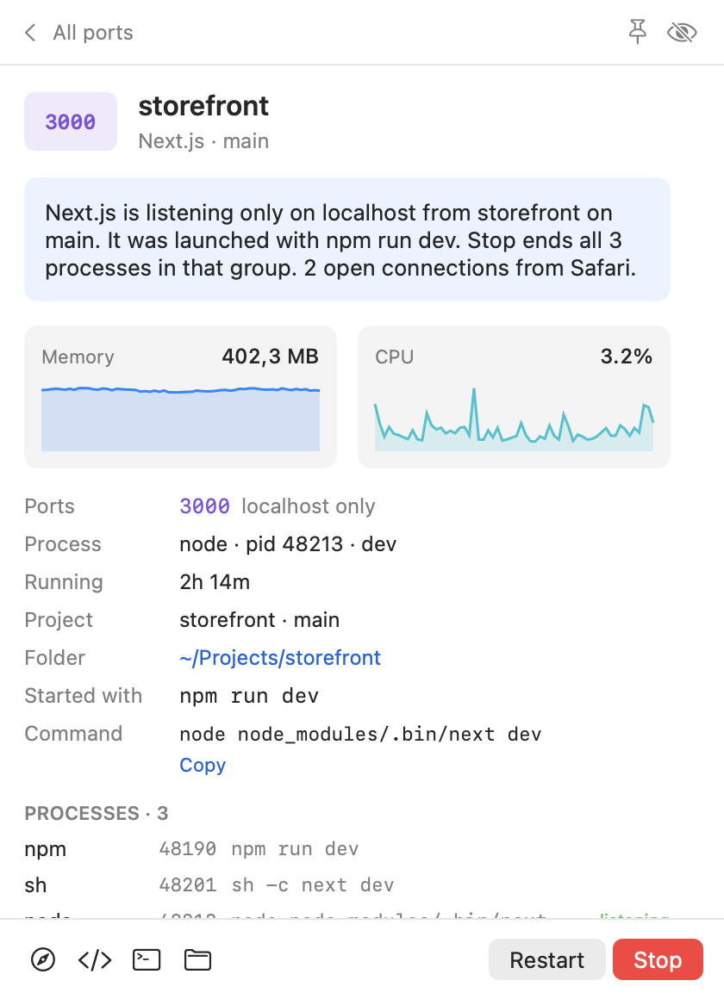
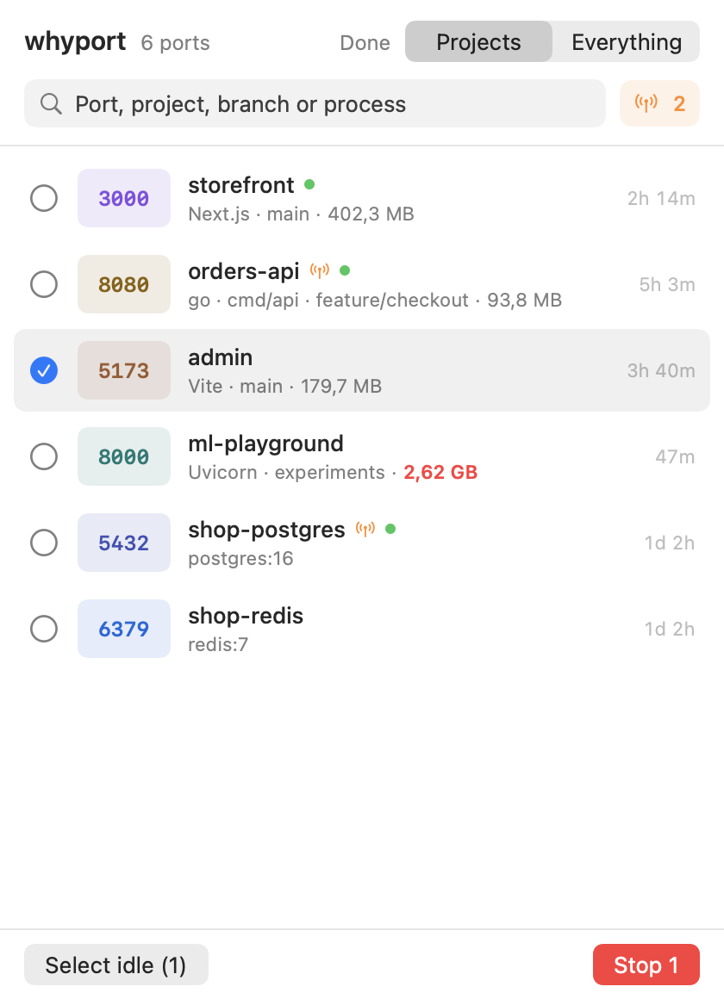

# WhyPort

**A macOS menu bar app that shows which ports your dev servers are using, explains why each one is open, and stops it with one click.**

<p align="center">
  <picture>
    <source media="(prefers-color-scheme: dark)" srcset="docs/list-dark.png">
    
  </picture>
  &nbsp;
  <picture>
    <source media="(prefers-color-scheme: dark)" srcset="docs/detail-dark.png">
    
  </picture>
</p>

## Why

You run a project and get `Error: port 3000 is already in use`. `lsof -i :3000` gives you a PID, but not what it is, which project it belongs to, or whether you still need it. Killing it often isn't enough either: `npm run dev` starts a new server right away.

WhyPort answers those questions in one place:

- **Which project and branch** the server belongs to, and the command that started it (`npm run dev`, `go run`, a Gradle task, a Docker container)
- **Who is using it**: live connections and the processes on the other end
- **Whether other devices can reach it**: a port open on all interfaces is visible to everyone on your Wi-Fi
- **How to get rid of it**: Stop ends the server together with the `npm`/`pnpm`/`go run` process that started it, so nothing comes back

## Install

Requires macOS 14 (Sonoma) or later, on Apple Silicon or Intel.

1. Download `WhyPort.dmg` from [Releases](https://github.com/ozers/whyport/releases/latest).
2. Open it and drag **WhyPort** into **Applications**.
3. Open WhyPort. The app isn't notarized by Apple yet, so macOS blocks it the first time. Go to **System Settings → Privacy & Security**, scroll down, and click **Open Anyway**.

If you prefer the terminal, this removes the block instead of step 3:

```bash
xattr -dr com.apple.quarantine /Applications/WhyPort.app
```

To build it yourself, see [Build from source](#build-from-source).

## How to use it

Click the icon in the menu bar or press **⌃⌥P** from anywhere.

**The list** shows one row per server. Each row shows:
- the port
- the project name, the framework and the git branch
- the memory it uses and how long it has been running

Some rows also carry small markers:

| Marker | Meaning |
| --- | --- |
| Orange antenna | Reachable from your network, not only from this Mac |
| Green dot | Something is connected right now |
| Red memory | Over your memory limit (2 GB by default) |

**Projects / Everything**: Projects shows your dev servers, databases and containers. Everything also shows editors, build daemons and system apps that happen to listen on a port.

**Click a row** for the full story:
- a one-sentence explanation
- memory and CPU charts for the last ten minutes
- every process in the group, and its connections
- buttons to open it in the browser, your editor, a terminal or Finder

**Stop** ends the whole group. If something ignores it, a **Force quit** button appears.

**Restart** stops the server and runs the same command again in the same folder. Output goes to `~/Library/Logs/WhyPort`. Docker containers use `docker restart`.

**Right-click a row** to pin it to the top, hide it, copy its URL, or open the project in your editor or terminal.

**Select** lets you stop several servers at once. **Select idle** picks the ones with no connections, no CPU use and more than 30 minutes of uptime.

<p align="center">
  <picture>
    <source media="(prefers-color-scheme: dark)" srcset="docs/select-dark.png">
    
  </picture>
</p>

## Settings

Click the gear at the bottom of the list.

- **General**:
  - open at login
  - the ⌃⌥P shortcut
  - the server count next to the menu bar icon
  - asking before stopping project servers (databases, apps and containers always ask)
- **List**: hide temporary ports (49152 and up) in Everything. The system and apps pick these at random.
- **Open in**: which editor and terminal the buttons use. Supported:
  - editors: Cursor, VS Code, IntelliJ IDEA, Zed, Sublime Text, Xcode
  - terminals: Terminal, iTerm, Ghostty, Warp, kitty
- **Notifications**: WhyPort can notify you when:
  - a port becomes reachable from the network
  - a server goes over the memory limit
  - optionally, when a server starts or stops

  Notifications have a Stop button.
- **Pinned and hidden**: everything you pinned or hid, with a button to undo it.
- **About**: version, update check, restart logs, and Quit.

## Is it safe?

- **Nothing leaves your Mac.** WhyPort reads `lsof`, `ps` and `docker ps`. The only network request is the update check, and only when you click it.
- **No admin rights.** It sees and stops only processes that run as your user.
- **It doesn't stop the wrong things.** A stop group never includes terminals, editors, coding agents (Claude Code, Codex, Cursor), pm2, or shared build daemons such as Gradle's. Databases, apps and containers ask before stopping.
- **Stop is polite first.** Stop sends `SIGTERM`, so servers can shut down cleanly. `SIGKILL` is sent only when you press Force quit.

## FAQ

**macOS says WhyPort can't be opened.**
The app isn't notarized yet. Use **Open Anyway** in System Settings → Privacy & Security, or the `xattr` command from [Install](#install).

**A server I'm running doesn't show up.**
Switch to **Everything**. If it's there, WhyPort couldn't find a project folder for it: no `package.json`, `go.mod`, `Cargo.toml`, `pyproject.toml`, `build.gradle` or similar above its working directory. Servers started by another user, such as `root`, aren't visible.

**Restart didn't bring my server back.**
Open the log from the detail view, or look in `~/Library/Logs/WhyPort`. Restart runs the command through your login shell, so it gets the same `PATH` as a new terminal window.

**Does it work without Docker?**
Yes. Docker support turns on by itself when the `docker` command is available.

## Build from source

You need macOS 14 or later and the Xcode Command Line Tools (`xcode-select --install`). Xcode itself is not needed.

```bash
git clone https://github.com/ozers/whyport.git
cd whyport/app
./build-app.sh --install
```

| Command | What it does |
| --- | --- |
| `./build-app.sh` | Builds `app/.build/WhyPort.app` for this Mac |
| `./build-app.sh --install` | Builds, copies to `/Applications` and opens it |
| `./build-app.sh --universal --dmg` | Apple Silicon + Intel build, packed into `WhyPort.dmg` with a drag-to-Applications window |
| `./build-app.sh --test` | Runs the checks |
| `./make-artwork.sh` | Renders the app icon and DMG background from `Sources/WhyPort/Artwork.swift` |

Every push to `main` and every pull request also builds `WhyPort.dmg` in GitHub Actions. You can download it from the run's **Artifacts**.

### How it works

1. `lsof` lists TCP sockets that are listening, and the connections to them.
2. `ps` gives the process table: commands, parents, uptime, memory and CPU. WhyPort walks up from the listening process through launchers such as npm, pnpm, yarn, bun, `go run` and `cargo run`. That finds everything that belongs to one server.
3. It walks up from each working directory to the nearest project file for the name. `.git/HEAD` gives the branch.
4. When Docker holds a port, `docker ps` maps it to a container.

It rescans every 2 seconds while the window is open and every 10 seconds in the background.

### Releasing

Push a version tag:

```bash
git tag v0.1.0
git push origin v0.1.0
```

GitHub Actions then does the rest:
1. It builds a universal app and packs it into `WhyPort.dmg`.
2. It creates a GitHub release with the DMG attached.
3. It attaches a filled-in Homebrew cask (`whyport.rb`) to the same release.

If these repository secrets are set, the workflow also signs the app with a Developer ID and has Apple notarize it. Then macOS opens it without the "can't be opened" warning. Without them, the release is ad-hoc signed.

| Secret | What it is |
| --- | --- |
| `MACOS_CERTIFICATE` | The Developer ID Application certificate exported as `.p12`, base64 encoded (`base64 -i cert.p12 \| pbcopy`) |
| `MACOS_CERTIFICATE_PASSWORD` | The password you gave the `.p12` export |
| `APPLE_ID` | The Apple ID email of the developer account |
| `APPLE_TEAM_ID` | The 10-character team ID from developer.apple.com |
| `APPLE_APP_PASSWORD` | An app-specific password from account.apple.com |

### Command line version

WhyPort started as a small Node CLI, and it is still in the repo:

```bash
node src/cli.js            # live table
node src/cli.js 3000       # why 3000 is open
node src/cli.js kill 3000
```

## License

[MIT](LICENSE)
